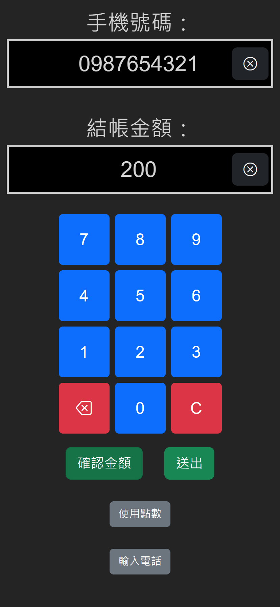
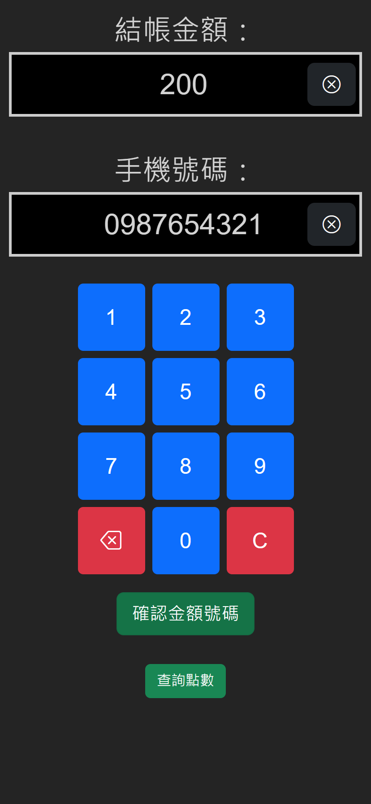

# Simple Loyalty Point

[中文說明](README.zh-tw.md)

[DEMO](https://scott.is-a.dev/point)

This full-stack project creates a simple customer loyalty point system, offering two interfaces: a customer page and a employee page. After the employee interface enters the amount, the customer can collect points by confirming their phone number on the customer page. The ratio of points to the amount can be adjusted through the config. The project's frontend is built with React.js, the backend with Node.js, and the database is MongoDB. This project was bootstrapped with [express-es6-spa-example](https://github.com/scott1991/express-es6-spa-example).

## Tech Stack

- Node.js
- Express
- Mongoose
- MongoDB
- Socket.IO
- React.js
- Bootstrap 5

## Features

- **Real-time Interaction**: Using `Socket.IO`, the client side, checkout side, and server can communicate in real time. As the checkout side enters an amount, it immediately appears on the client side without refreshing. The same happens when entering a phone number.
- **Customizable Ratio**: The ratio between the amount spent and the points awarded can be determined by modifying `server/config.json`.
- **On-screen Numeric Buttons**: Numeric buttons are displayed on the screen, convenient for devices like tablets. The layout for the amount is like a calculator, and for the phone number, it's like a phone keypad.
- **API for Checkout Integration**: The checkout can use an API to input amounts. This makes it easy to connect with other POS systems.

## Installation
1. Clone this project and install dependencies with `npm install`.
2. Rename `server/config.js.example` to `config.js` and complete its content (MongoDBURI).
3. Start the program with `node index.js`.
4. Open the `Employee` and `Customer` links at their respective devices.

## Requirements

- Node.js (recommended version 12.20.0+)
